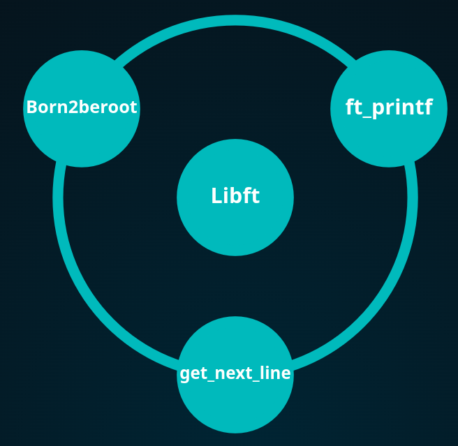

# 42 Rank 1

### 02/10/2023

After a long swimming experience at the 42 Piscine, here we are.
The first rank of projects for the 42 School experience.
We'll face 4 projects for this rank:

#### libft project: Grade 125/100

This project is your very first project as a student at 42. 
You will need to recode a few functions of the C standard library as well as some other utility functions that you will use during your whole cursus.

#### ft_printf project: Grade 100/100

This project is pretty straightforward, you have to recode printf.
You will learn what is and how to implement variadic functions.
Once you validate it, you will reuse this function in your future projects.

#### get_next_line project: Grade 125/100

May it be a file, stdin, or even later a network connection, you will always need a way to read content line by line.
It is time to start working on this function, which will be essential for your future projects.

#### born2beroot: Grade 110/100

This project aims to introduce you to the wonderful world of virtualization.

### 26/11/2023

Today I've finished the Rank 1 of 42 Lisboa, it was quite a learning process, implementing all the knowledge acquired since the very start of the 42 cursus and learn even more through my journey at each project.
It's really amazing to acknowledge the learning curve that is given by each successful project and being proud of all the struggle and effort put on each and every one of them.
From now on the projects will get harder each time, but for now it's a great reward to have done all of that.
Let there be more!

